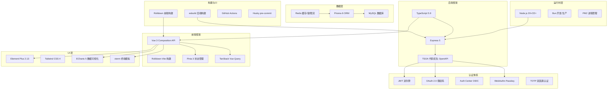

# 01 — 项目技术全景概述

> 本文档是 AppServerMonorepo 的高层级项目概述，涵盖系统架构、技术栈、核心模块和技术亮点，兼具开发文档入口和项目展示用途。

## 项目简介

AppServer 是一个企业级 SaaS 管理平台，**核心业务为 AI API 中转代理（Relay）**。平台提供完整的用户管理、权限控制、计费结算、工单支持、通知推送等企业级功能，采用**全栈 TypeScript monorepo 架构**，后端基于 Express 5 + Prisma ORM，前端基于 Vue 3 + Element Plus。

系统定位为 AI 服务中间件，向上对接 OpenAI、Anthropic、Google Gemini 等 AI 提供商 API，向下为企业或个人用户提供统一的 API 接入层，聚合渠道管理、负载均衡、故障转移、模型映射、用量计费和访问控制等能力。

## 技术栈全景



| 层次 | 技术选型 | 用途 |
|------|----------|------|
| **后端运行时** | Node.js 20+/22+, Bun (dev + prod via PM2) | 应用服务器，集群模式 |
| **后端框架** | Express 5 + TypeScript 5.9 + TSOA | Web 框架 + 代码优先 API 规范 |
| **数据访问** | Prisma 6 + MySQL (ioredis for Redis) | ORM，71 个数据模型 |
| **缓存/消息** | Redis (ioredis, LRU-Cache) | 缓存、分布式锁、限流、会话 |
| **前端框架** | Vue 3 (Composition API) + TypeScript + Rolldown-Vite | SPA 应用 |
| **UI 组件** | Element Plus 2.13 + Tailwind CSS 4 | 企业级 UI 组件库 |
| **状态管理** | Pinia 3 + TanStack Vue Query | 本地状态 + 服务端缓存 |
| **数据可视化** | ECharts 5 + heatmap.js | 图表、热力图 |
| **认证协议** | JWT / OAuth 2.0 / WebAuthn / TOTP | 多策略认证体系 |
| **后端构建** | esbuild (tsc-alias 路径别名) | 极速打包 |
| **前端构建** | Rolldown-Vite (Terser + Gzip + Obfuscator) | 生产构建优化 |
| **进程管理** | PM2 (cluster mode) | 多进程部署 |
| **质量管理** | ESLint + Prettier + Vitest + Husky | 代码质量保障 |
| **CI/CD** | GitHub Actions (路径过滤触发) | 自动化测试与部署 |

## 项目规模指标

以下数据基于实际代码库统计，反映项目的工程体量：

| 维度 | 指标 | 说明 |
|------|------|------|
| **后端 Controllers** | 49 个 | 覆盖 16 个业务模块，按 v1/v2 版本组织 |
| **后端 Services** | 60 个 | 按功能域分 13 个目录（auth, relay, billing, users 等） |
| **后端 Repositories** | 93 个 | Repository + Store 双层数据访问模式 |
| **后端 Middleware** | 23 个 | 21 层中间件链（含内部子中间件） |
| **后端 DTOs** | 42 个 | TSOA 校验装饰器定义请求/响应结构 |
| **Prisma 模型** | 71 个 | MySQL 数据库，Core 企业级引擎 |
| **前端 Views** | 143 个 | 59 个页面视图 + 75+ 个子组件 |
| **前端 Services** | 52 个 | 业务逻辑封装，单例模式 |
| **前端 Pinia Stores** | 12 个 | 全局状态管理 |
| **前端路由** | 67+ 条 | 带权限守卫的细粒度路由控制 |
| **前端 Components** | 30+ 个 | 共享组件（布局/认证/权限/编辑器等） |
| **共享权限枚举** | 135+ 个 | `resource:action` 格式，唯一规范源 |
| **业务错误码** | 47 个 | 覆盖认证/校验/权限/限流等场景 |
| **通知事件类型** | 22 种 | 按域分组（账单/安全/RAM/工单） |

## 核心架构与设计模式

### Monorepo 架构

使用 **pnpm workspace** 构建 monorepo，包含 3 个应用和 4 个共享包：

```
AppServerMonorepo/
├── apps/                         # 应用
│   ├── backend/                  # @appserver/backend  (Express + Prisma + TSOA)
│   ├── frontend/                 # @appserver/frontend (Vue 3 + Element Plus + Vite)
│   └── docs-site/                # @appserver/docs-site (Vue 3 文档站点)
├── packages/                     # 共享包
│   ├── shared/                   # @appserver/shared (Permission/CustomCode 等 — 唯一规范源)
│   ├── config-typescript/        # 共享 tsconfig.base.json
│   ├── config-prettier/          # 共享 .prettierrc.json
│   └── utils/                    # 共享工具函数
├── scripts/                      # 仓库级编排脚本
└── pnpm-workspace.yaml           # 聚合所有 apps/* 和 packages/*
```

**唯一规范源（SSOT）模式**：`@appserver/shared` 包是 Permission 枚举、CustomCode 业务错误码、NotificationEvent 通知事件等业务常量的唯一数据源。前后端通过 `workspace:*` 依赖引用，修改共享包后前后端自动生效。预提交脚本 `validate-frontend-permissions.mjs` 校验前后端权限定义的一致性。

### 后端三层架构

```
Controller (HTTP 层)
    ↓ 调用
Service (业务逻辑层) — 单例模式
    ↓ 编排
Repository (数据访问层) — 封装 Prisma 查询
    ↓ [可选]
Store (缓存层) — Redis 缓存，双层数据访问
```

- **Controller**（49 个）：TSOA 装饰器定义路由路径、HTTP 方法、参数校验、安全方案。不含业务逻辑，职责仅限于 HTTP 协议适配。
- **Service**（60 个）：单例模式（`getInstance()`），编排多个 Repository 实现业务规则。按功能域分 13 个目录。
- **Repository**（93 个）：封装 Prisma 查询。部分"热点数据"模块额外存在 Store 层（Redis 缓存），如权限缓存、配置缓存等，实现双层数据访问模式。
- **DTO**（42 个）：使用 TSOA 校验装饰器（`@IsString`, `@IsInt`, `@Min`, `@Max` 等）定义请求体验证规则和响应数据结构。

### 请求生命周期

Express 应用的 21 层中间件链，按精确顺序执行：

```
1.  CORS 中间件                       跨域配置（Origin allowlist 检查）
2.  Request Size 记录                 提前记录 Content-Length 头
3.  Request Size Guard (双层检测)      先检查 Content-Length，再对 multipart 逐字节计数
4.  /relay/proxy → express.raw()       大文件上传专用 raw body 解析
5.  express.json()                     JSON body 解析
6.  express.urlencoded()               URL-encoded body 解析
7.  Cookie 绑定修复                    Express 5 中 res.cookie 的 this 绑定
8.  Memory Monitor                     60s 定时器，1.2GB 报警阈值
9.  Locale Middleware                  从请求头解析语言区域
10. Response Timeout                   600s 超时，超时返回 504
11. URL Token Extractor               ?token= 参数 → Authorization header
12. Request ID Middleware              为每个请求附加 UUID
13. Logging Middleware                 打印方法/路径/状态码/耗时
14. Response Wrapper                   {code, message, data} 统一封装
15. Error Tracker                     IP 错误计数，到达阈值自动封禁
16. IP Blacklist Check                 IP 黑名单拦截（放行白名单 IP）
17. Streaming Middleware               流式响应拦截（stream=true 的请求）
18. RegisterRoutes(app)                TSOA 自动生成的所有业务路由
19. Swagger UI                         /docs 页面
20. 404 Catch-all                      未匹配路由
21. Exception Middleware               全局异常处理兜底
```

> 中间件设计亮点：**双层请求体大小守卫** — 先校验 Content-Length 头防止明显超限请求，再对 multipart 请求体执行逐字节计数防止伪造 Content-Length 的攻击。该设计展示了在生产环境中应对实际安全威胁的工程能力。

### 单例模式

全部 60 个 Service 和 93 个 Repository 使用单例模式，保证缓存状态的一致性和内存效率：

```typescript
export class UserService {
  private static instance: UserService;
  public static getInstance(): UserService {
    if (!UserService.instance) {
      UserService.instance = new UserService();
    }
    return UserService.instance;
  }
}
```

### 统一响应格式

所有 API 响应统一包裝：

```typescript
{ code: number, message: string, data?: T }
// code: 0 = 成功, 1001+ = 业务错误 (对应 CustomCode 枚举)
// CustomCode 覆盖: 认证失败(1001)、校验失败(1002)、权限不足(1004)、
// Token过期(1013/1006)、IP封禁(1012)、重放保护(1016-1017)、
// 2FA要求(1018)、分布式锁冲突(1024)、外部登录(1032-1040) 等 47 种场景
```

## 关键技术亮点

### 1. AI API 反向代理（Relay — 核心业务）

Relay 模块是平台的核心能力，提供对 OpenAI、Anthropic、Google Gemini 等 AI 提供商 API 的统一反向代理：

**架构层次**：8 个 Service + 12 个 Repository/Store 文件支撑。

| 服务 | 职责 |
|------|------|
| `RelayProxyService` | 核心代理引擎，axios 转发请求，处理流式/非流式响应 |
| `RelayTokenService` | 中转令牌验证（`rlt_` 前缀），配额/速率限制 |
| `RelayChannelService` | 上游渠道配置管理 |
| `RelayConfigService` | 全局配置，健康检查，并发控制 |
| `RelayPoolResolverService` | 上游池路由解析，负载均衡 |
| `ModelPricingService` | 模型价格管理 |
| `DataTransformerService` | AI 提供商请求/响应格式适配 |
| `TimePeriodMultiplierService` | 时段倍率（高峰期价格调整） |

**关键能力**：

- **多渠道负载均衡**：支持多个上游 AI API 渠道，按优先级和权重分配请求，HTTP agent 配置 keepAlive + 最大 10 sockets 连接池
- **故障转移（Failover）**：渠道故障时自动切换至备用渠道，`RelayTokenFailoverConfig` 配置故障转移策略，支持结构化能力交集检查
- **模型映射**：通过 `ModelPricing` 实现模型名称级的精确映射，`resolveModelId()` 统一解析入口
- **实时计费**：按模型 + 时段倍率 + 用量阶梯实时计算费用，使用 `decimal.js` 保证金额精度
- **配额控制**：Token 级配额限制 + 基于时间窗口的配额窗口（`RelayTokenQuotaWindow`）
- **使用量追踪**：每次代理请求记录到 `RelayUsage`，支持按 Token/用户/时间维度的聚合查询
- **并发保护**：请求级别并发租约机制，防止上游过载

### 2. 认证与安全体系

系统实现了 8 种认证方式，覆盖从传统密码到无密码认证的完整光谱：

| 认证方式 | 实现 | 适用场景 |
|----------|------|----------|
| JWT 双令牌 | Access Token（极短过期 5s/15min）+ Refresh Token（长过期 8h/7天） | 标准 Web 登录 |
| OAuth 2.0 | 完整授权码流程，客户端管理 + 审核 | 第三方应用授权 |
| Auth Center | OIDC 风格集中认证中心，JWKS 发现端点 | 统一身份认证 |
| WebAuthn (Passkey) | 基于 `@simplewebauthn/server` 的公钥认证 | 无密码登录 |
| TOTP 2FA | 双因素认证（设置/验证/恢复码/受信设备） | 敏感操作提权 |
| 第三方登录 | Google、GitHub 等社交账号绑定 | 社交登录 |
| 扫码登录 | 二维码 + 轮询认证会话 | 移动端扫码 |
| Relay Token | `rlt_` 前缀令牌认证（用于 API 代理） | 程序化 API 调用 |

**安全防护机制**：

- **重放攻击防护**：HMAC-SHA256(nonce + timestamp + path + body, signingKey) 签名 + 5 分钟时间戳窗口 + Nonce Redis 原子去重（10 分钟 TTL）。通过 `@ReplayProtected()` TSOA 装饰器声明式启用
- **reCAPTCHA 人机验证**：`@CaptchaProtected()` 装饰器 + 信任 Cookie 窗口机制
- **IP 黑名单**：双重拦截（errorTrackerMiddleware 自动封禁 + ipBlacklistCheckMiddleware 手动管理）
- **速率限制**：Redis 分布式速率限制 + 邮件频率独立限制
- **请求大小守卫**：双层检测防止超大请求攻击
- **受信设备**：Cookie 签名认证，2FA 信任设备列表

**实现规模**：6 个 Auth Service + 10+ 个认证相关 Repository + 6 个认证/安全中间件。

### 3. 权限系统（RBAC + RAM）

系统实现了从基础 RBAC 到企业级 IAM 的完整权限模型：

**RBAC 基础层**：
- 用户组（Group）承载权限集合
- 权限计算公式：`最终权限 = 组权限 + 附加权限 - 移除权限`
- `@CheckPermission()` 装饰器支持 ALL（AND）和 ANY（OR）两种检查模式
- 135+ 个细粒度权限（`resource:action` 格式），覆盖全部业务模块

**RAM（Resource Access Management）— 类 AWS IAM 子账户体系**：

| 组件 | 对应 Prisma 模型 | 用途 |
|------|------------------|------|
| 子用户 | `RamRole`（含类型: sub_account/sub_user） | 子账户身份 |
| 角色 | `RamRole`（含 trustPolicy） | 跨账户权限委托 |
| 策略 | `RamPolicy`（策略文档定义权限语句） | 权限声明 |
| 策略附件 | `RamPolicyAttachment` | 策略与实体的绑定 |
| 角色扮演会话 | `RamRoleSession` | AssumeRole 临时凭证 |
| 用户绑定 | `RamUserRoleBinding` | 用户 ↔ 角色 |
| 组绑定 | `RamGroupRoleBinding` | 组 ↔ 角色 |

**为什么 RAM 是重要技术亮点**：在常规 CRUD 项目中，提供一个完整的类 AWS IAM 子账户系统是罕见的工程投入。它展示了从简单 RBAC 到复杂身份联邦的架构演进能力，以及在多租户场景下对权限模型的深刻理解。

**前后端一致性保障**：后端 `@CheckPermission()` + 前端 `PermissionWrapper` 组件 + Pinia `hasPermission()` / `hasAnyPermission()` / `hasAllPermissions()` 方法 + 预提交脚本校验，形成完整链路。

### 4. 计费与结算系统

| 模块 | 模型 | 特性 |
|------|------|------|
| 余额 | `BalanceAccount` + `BalanceTransaction` | 行锁 + 事务保证 |
| 月卡 | `MonthlyPassTemplate` + `UserMonthlyPass` + 配额窗口 | 套餐订阅 + 用量配额 |
| 兑换码 | `RedemptionCode` | 生成/兑换/过期管理 |
| 按量计费 | `ModelPricing` + 时段倍率 + 用量记录 | 实时模型计价 |

事务一致性保证：所有计费操作通过 **Redis 分布式锁** + **数据库事务** 双重保障，配合 `DistributedLockService` 防止并发计费问题。

### 5. 通知系统

事件驱动架构，支持 22 种通知事件，按域分组：

| 域 | 事件数 | 示例 |
|----|--------|------|
| 账单与配额 | 7 | 余额过低、充值成功、月卡配额不足、Token 耗尽 |
| 工单 | 4 | 待审核、状态更新、公开回复、被分配 |
| 安全 | 5 | 异常登录、多次登录失败、密码变更、2FA 状态、账号状态 |
| RAM | 6 | 策略附加/分离、角色绑定变更、子用户/角色/策略创建删除 |

其中 4 个为阈值类事件（`THRESHOLD_NOTIFICATION_EVENTS`），支持用户自定义触发阈值，通过 `NotificationPreference` 进行细粒度订阅管理。

### 6. 日志系统

采用 **Winston** 结构化日志 + 每日轮转：

- 12 个日志类别：app, auth, db, api, relay, email, security, billing, notification, script, system
- 自动截断：`LOG_TRUNCATE_CONFIG` 控制日志长内容截断
- `@LogRoute()` 装饰器自动记录 Controller 方法的请求和响应
- 数据库持久化：`APILog` 模型记录每次请求详情，支持模糊搜索
- 业务日志：`BusinessLog` 模型记录关键业务操作，用于审计追踪

### 7. 前端工程化

| 维度 | 实现 |
|------|------|
| 状态管理 | 12 个 Pinia Store（userInfo, permission, chat, i18n, theme 等） |
| 业务封装 | 52 个 Service（单例模式 `getInstance()`） |
| 事件总线 | 6 个 EventBus 实例：auth / web / customCode / i18n / window / global |
| 国际化 | 3 种语言（zh-CN / en / emoji），类型安全翻译键，懒加载 |
| 异步管理 | TanStack Vue Query（staleTime: 5min, gcTime: 10min, 指数退避重试） |
| 数据可视化 | ECharts 5（图表、漏斗图）+ heatmap.js（热力图） |
| 终端模拟 | xterm + xterm-addon-fit（远程终端接入） |
| 自动更新 | WatchDog 每 5 秒轮询 `index.html` 的 hash，检测新版本弹出更新提示 |
| 生产构建 | Rolldown 打包 + Terser 压缩 + Gzip (>10KB) + javascript-obfuscator 混淆 + 打包分析 |

**类型安全 i18n**：通过 `I18nENAvailableKeys` 泛型约束翻译键结构，编译时强制保证 zh-CN、en、emoji 三组的键结构完全一致，杜绝遗漏翻译。

### 8. 全栈 TypeScript 类型体系

从后端到前端贯穿的 TypeScript 类型安全：

```
Controller TSOA 装饰器 → tsoa spec-and-routes → swagger.json
    ↓ scripts/sync-swagger-to-frontend.mjs
frontend/ swagger.json → @hey-api/openapi-ts → src/client/ (typed SDK)
```

- 后端：TSOA 装饰器类型推导 → OpenAPI 规范
- 前端：OpenAPI → TypeScript SDK（类型安全 API 调用，不可手动编辑）
- 共享包：`@appserver/shared` 唯一规范源（Permission, CustomCode 等）
- 运行时校验：Zod schema（`src/schemas/`）补充运行时数据验证
- 泛型工具：`SuccessResponse<T>` 统一响应类型 + Z...
- 前端生成的 `src/client/` 由 `.gitignore` 排除，构建时自动生成

## 开发工作流

### API 开发流程

添加新接口的标准 4 步流程：

```
1. DTO 定义     → src/api/dto/*.dto.ts (TSOA 校验装饰器)
2. Repository   → src/store/*.repository.ts (Prisma 查询封装)
3. Service      → src/services/*/*.service.ts (业务逻辑，单例模式)
4. Controller   → src/api/controllers/**/*.controller.ts (TSOA 路由装饰器)
    ↓
pnpm run openapi:gen:all → 自动生成 OpenAPI 规范 + 前端 TypeScript SDK
```

### OpenAPI 生成流水线

```
backend (tsoa spec-and-routes) → swagger.json
    ↓ (sync-swagger-to-frontend.mjs 复制)
frontend (openapi-ts) → src/client/ (typed SDK + API constants + type maps)
```

### 代码质量保障

Husky pre-commit hook 依次执行：
1. OpenAPI 规范生成
2. 前端权限常量一致性校验（`validate-frontend-permissions.mjs`）
3. ESLint 代码检查
4. Prettier 代码格式化
5. TypeScript 类型检查（所有项目）

## 项目价值总结

> AppServer 是一个完整的企业级 SaaS 平台，覆盖 AI API 代理转发、用户管理、权限控制、计费结算、工单与通知等核心业务模块。采用全栈 TypeScript monorepo 架构，后端基于 Express 5 + TSOA 实现代码优先 OpenAPI 生成，前端基于 Vue 3 + Pinia 实现类型安全的状态管理，共享包确保前后端常量一致。

> 项目展示了深厚的技术纵深：从基础的三层架构和单例模式，到类 AWS IAM 的资源访问管理（RAM），从 HMAC-SHA256 防重放攻击到 WebAuthn 无密码认证，从多渠道故障转移到实时代理计费。后端代码量达到 200+ 关键文件、71 个数据库模型，前端 143 个视图页面和 52 个业务 Service，体现了对复杂业务系统的整体架构能力。

> 技术亮点包括：全栈 TypeScript 类型安全体系、代码优先 OpenAPI 规范驱动的前后端协作、Redis 集群与分布式锁、多级安全防护体系（JWT / OAuth / WebAuthn / 2FA / 防重放 / CAPTCHA）、企业级权限模型（RBAC + RAM）、以及高可用的 AI API 代理引擎。系统设计遵循工程化最佳实践，中间件链、日志审计、限流熔断、读/写分离等企业级能力一应俱全。

---

**相关文档**：

| 文档 | 内容 |
|------|------|
| [02-backend.md](./02-backend.md) | 后端详解：TSOA 3层模式、中间件、服务目录 |
| [03-frontend.md](./03-frontend.md) | 前端详解：Pinia stores、事件总线、API 客户端 |
| [04-shared-package.md](./04-shared-package.md) | 共享包：Permission 枚举、CustomCode |
| [05-database.md](./05-database.md) | 数据库：71 个模型、关系、软删除 |
| [06-api-development.md](./06-api-development.md) | API 开发流程：到 Repository 完整步骤 |
| [07-authentication.md](./07-authentication.md) | 认证与授权：JWT、OAuth、2FA、防重放 |
| [08-openapi-pipeline.md](./08-openapi-pipeline.md) | OpenAPI 生成流水线 |
| [09-deployment.md](./09-deployment.md) | 构建与部署：esbuild、PM2、环境变量 |
